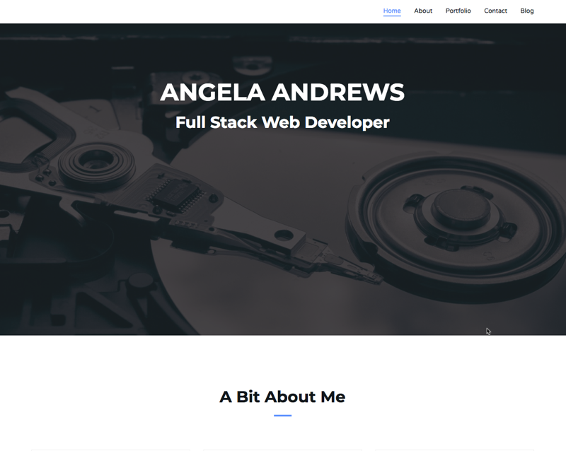

# Updated Portfolio

We're 11 weeks into our coding bootcamp and we're asked to proudly display our projects as well as update our site using our new found skills.

## Language, Frameworks, Technologies, Images Used
- HTML
- CSS
- Font Awesome v5
- [Bootstrap Template](https://colorlib.com/wp/template/creative-agency/)
- [Unsplash](https://unsplash.com/photos/1iVKwElWrPA)

## Process

I paired the template down to just the minimum I'd need for a website. The hero image was perfect to highlight my technical background. After removing several sections from the page and the navbar, I was able to customize the template with different font awesome icons and updated those that weren't working to v5. Added my projects and along with icons that linked to the site where they're hosted, I also added a github icon to link to my repo. I created a disposable email address for the mail icon at the bottom as well as linked to social media sites.

 

